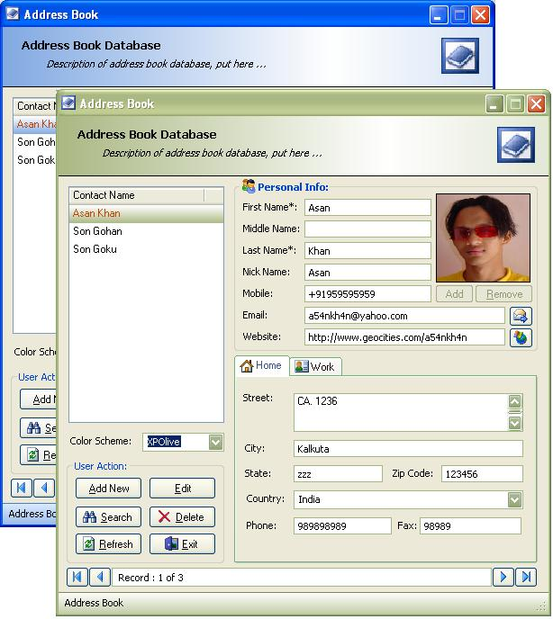



## \_\_\_ Advance Addresses Book  XP \( support Luna Theme; XP Blue,XpOlive and XPSilver\) \_\_\_

### Description

Hi! This is my first submision.

This is a complete address book with picture likes

school database to keeps track of your relatives,

your friends and your classmates.

Look and feel of WIndows XP regardless an operating system. download now! and don't forget to vote me .....
 
### More Info
 

             |
---                |---
**Submitted On**   |2004-07-28 14:07:40
**By**             |[Asan Khan](https://github.com/Planet-Source-Code/PSCIndex/blob/master/ByAuthor/asan-khan.md)
**Level**          |Intermediate
**User Rating**    |3.8 (19 globes from 5 users)
**Compatibility**  |VB 5\.0, VB 6\.0
**Category**       |[Databases/ Data Access/ DAO/ ADO](https://github.com/Planet-Source-Code/PSCIndex/blob/master/ByCategory/databases-data-access-dao-ado__1-6.md)
**World**          |[Visual Basic](https://github.com/Planet-Source-Code/PSCIndex/blob/master/ByWorld/visual-basic.md)
**Archive File**   |[\_\_\_\_Advanc1799069302004\.zip](https://github.com/Planet-Source-Code/asan-khan-advance-addresses-book-xp-support-luna-theme-xp-blue-xpolive-and-xpsilver__1-55216/archive/master.zip)

